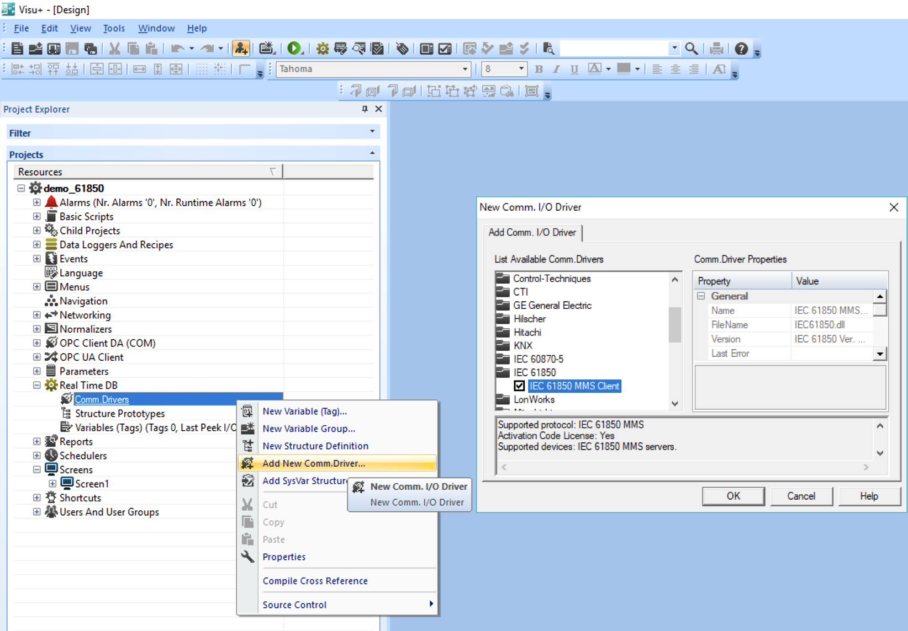

[[_TOC_]]

# Принципиальная схема взаимодействия:

Задатчиком дискретного входа симулируется срабатывание сигнала телесигнализации (сигнал - выключатель включен). Контроллер принимает этот сигнал и активирует дискретный выход (сигнал - сигнальная лампа на шкафу диспетчеризации предупредительно мигает 5 секунд и остается во включенном состоянии). На мнемосхеме Visu+ меняется положение выключателя, и также зажигается сигнальная лампа.

# 1 Этап разработки - подготовка проекта PC WORX

Для возможности связывания сигналов ввода вывода с информационной моделью IEC 61850 необходимо создать проект PC WORX с устройствами AXL F BK SAS и AXC 1050 и модулями AXL F DI8/DO8, и задать им IP-адреса  

Для AXL F BK SAS требуется сделать параметризацию шины Axioline  

Для AXC 1050 требуется создать глобальные переменные (в группе **IEC61850**) для принятия в них сигналов из GOOSE сообщений от AXL F BK SAS 
- BK_SAS_Ind1_stVal - Положение выключателя
- BK_SAS_Ind1_t - Положение выключателя (метка времени)  
- GGIO1_SPCSO_stVal - Состояние дискретного выхода (сигнальная лампа) 
 

Важно создавать переменные именно в группе **IEC61850**, потому что поиск переменных для связывания с моделью IEC 61850 по-умолчанию производится в группе с этим названием.  

# 2 Этап разработки - конфигурация в PC WORX IED Configurator

В проект добавляются два устройства - AXL F BK SAS и AXC 1050  

Добавляются модули ввода-вывода AXL F DI8/DO8  

Устройствам назначаются IP адреса и связь с проектом PC WORX

Для передачи в GOOSE сообщениях и MMS репортах создается Dataset с двумя сигналами AXL F BK SAS:  
- LDevice1/GGIO1.Ind1.stVal - состояние GGIO1 (Generic Process I/O)
- LDevice1/GGIO1.Ind1.t - метка времени  

Создаются Goose Control Block и Report Control Block  
Trigger options:
- dchng - data change - репорт будет генерировать при изменении состояния сигнала в нем
- qchng - quality change - репорт будет генерировать при изменении качества сигнала
- gi - general interrogation - по запросу  

Отчет буферизированный - события накапливаются перед отправкой  
Отчет индексированный с 3 копиями - могут подключиться одновременно 3 клиента  

Связь сигнала с модуля AXL F DI8/DO8 с сигналом информационной модели IEC 61850 

Контроллер AXC 1050 будет передавать состояние своего выхода для отображения на мнемосхеме SCADA системы, необходимо также создать Dataset

И Report Control Block (только MMS сообщения для SCADA)

# 3 Этап разработки - связывание GOOSE сигналов в SCT Tool
Для связывания сигналов IEC61850 двух и более устройств между собой можно использовать утилиту [SCT Tool](https://www.fh-dortmund.de/de/fb/3/personen/lehr/harnischmacher/SCT.php), либо любую другую аналогичную. Утилита должна добавить сигналы из файла описания одного устройства в файл описания другого устройства, используя атрибут < ExtRef/>

Создание нового проекта подстанции

Импортируется созданный в PC WORX IED Configurator файл .scd

В логический узел LLN0 устройства IED_AXC_1050 добавляются входы из устройства IED_BK_SAS

Для генерации обновленного .scd файла необходимо добавить в проект новую подстанцию

Результатом работы программы будет сгенерированный .scd файл

# 4 Этап разработки - завершение связывания данных в PC WORX IED Configurator

Импортируется SCL файл, созданный в SCT Tool

Указанные в файле ExtRef входы доступны для связывания с внутренними переменными контроллера

Необходимо валидировать конфигурацию, после этого она может быть загружена в устройства кнопкой Configure IEDs

Диагностику и привязку сишналов можно проверить на странице устройства:
http://192.168.1.103/index.html#iomapping.html

# 5 Этап разработки - логика обработки GOOSE сигнала в PC WORX

В программе Main исполняется функциональй блок, который по пришедшему от AXL F BK SAS сигнала 5 секунд мигает выходным сигналом дампы, и после этого зажигает ее непрерывно.
Помимо этого включение дискретного выхода транслируется в переменную из группы IEC61850

# 6 Этап разработки - мнемосхема SCADA системы

На экране расположены два динамических элемента - мнемосхема с Q1 и панель индикации с лампой  

В проект добавляется драйвер IEC 61850

В свойствах драйвера определяются две станции - IED_BK_SAS и IED_AXC_1050

И импортируются теги из .cid файлов

Поскольку используются индексированные отчеты, автоматически импортированное имя RCB1 следует заменить на имя с учетом индекса - RCB101 (или RCB102, или RCB103)

# Демонстрация в Visu+  

Включение

Отключение

# Демонстрация в OMICRON IED Scout  

Включение  

Отключение  

